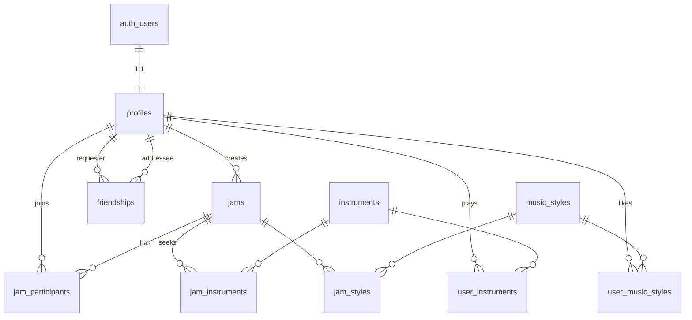

# FindMyJam — Schéma PostgreSQL / Supabase

Documentation du backend base de données pour l'application Jam Finder.

## Extensions

| Extension | Schéma | Usage |
|-----------|--------|-------|
| `postgis` | `extensions` | Recherche géographique (`geography`, `ST_DWithin`, GiST) |
| `pg_trgm` | `extensions` | Recherche floue de pseudos (index GIN trigram) |
| `citext` | `extensions` | Pseudos insensibles à la casse |

## Types énumérés

### `skill_level`
`beginner` · `intermediate` · `advanced` · `expert` · `all_levels`

### `friendship_status`
`pending` · `accepted` · `rejected` · `blocked`

---

## Tables

### `profiles`
Profil utilisateur (1:1 avec `auth.users`).

| Colonne | Type | Contraintes |
|---------|------|-------------|
| `id` | `uuid` | PK, FK → `auth.users(id)` ON DELETE CASCADE |
| `username` | `extensions.citext` | UNIQUE, min 3 caractères |
| `avatar_url` | `text` | nullable |
| `bio` | `text` | max 500 caractères |
| `skill_level` | `skill_level` | nullable |
| `location_name` | `text` | nullable |
| `latitude` / `longitude` | `double precision` | paire obligatoire si renseignée |
| `location` | `extensions.geography(Point, 4326)` | colonne générée (STORED) |
| `created_at` / `updated_at` | `timestamptz` | auto |

### `jams`
Session musicale.

| Colonne | Type | Contraintes |
|---------|------|-------------|
| `id` | `uuid` | PK |
| `creator_id` | `uuid` | FK → `profiles(id)` |
| `title` | `text` | NOT NULL |
| `description` | `text` | max 2000 caractères |
| `starts_at` | `timestamptz` | NOT NULL |
| `location_name` | `text` | NOT NULL |
| `latitude` / `longitude` | `double precision` | NOT NULL, bornes validées |
| `location` | `extensions.geography(Point, 4326)` | colonne générée |
| `skill_level` | `skill_level` | défaut `all_levels` |
| `max_participants` | `integer` | ≥ 2, défaut 10 |
| `created_at` / `updated_at` | `timestamptz` | auto |

### `jam_participants`
Participation à une jam. PK composite `(jam_id, user_id)`.

### `friendships`
Relation entre deux utilisateurs. Contrainte d'unicité sur la paire `(LEAST, GREATEST)` pour éviter les doublons inversés.

### Tables de référence
- `instruments` — catalogue (nom + slug unique)
- `music_styles` — catalogue (nom + slug unique)

### Tables de liaison (N:N)
- `user_instruments` — instruments d'un profil
- `user_music_styles` — styles d'un profil
- `jam_instruments` — instruments recherchés pour une jam
- `jam_styles` — styles d'une jam

---

## Diagramme ER



---

## Index

| Index | Table | Type | Objectif |
|-------|-------|------|----------|
| `profiles_location_gist_idx` | profiles | GiST | Proximité géographique |
| `jams_location_gist_idx` | jams | GiST | Carte / recherche rayon |
| `jams_starts_at_idx` | jams | B-tree | Filtre par date |
| `profiles_username_trgm_idx` | profiles | GIN (trigram) | Recherche pseudo |
| `jam_instruments_instrument_id_idx` | jam_instruments | B-tree | Filtre instrument |
| `jam_styles_music_style_id_idx` | jam_styles | B-tree | Filtre style |

---

## Triggers

| Trigger | Table | Action |
|---------|-------|--------|
| `on_auth_user_created` | `auth.users` | Crée un `profile` à l'inscription |
| `profiles_set_updated_at` | profiles | Met à jour `updated_at` |
| `jams_set_updated_at` | jams | Met à jour `updated_at` |
| `friendships_set_updated_at` | friendships | Met à jour `updated_at` |
| `jam_participants_check_capacity` | jam_participants | Bloque si jam pleine |
| `jam_participants_check_not_creator` | jam_participants | Empêche le créateur de rejoindre |

---

## Row Level Security (RLS)

RLS activé sur **toutes** les tables publiques.

| Table | SELECT | INSERT | UPDATE | DELETE |
|-------|--------|--------|--------|--------|
| `profiles` | authenticated | own | own | — |
| `jams` | authenticated | creator | creator | creator |
| `jam_participants` | authenticated | own | — | own ou creator |
| `friendships` | impliqués | requester | impliqués | impliqués |
| `instruments` / `music_styles` | authenticated | — | — | — |
| `user_instruments` / `user_music_styles` | authenticated | own | — | own |
| `jam_instruments` / `jam_styles` | authenticated | creator | — | creator |

---

## Fonctions RPC (recherche & pagination)

Pagination par **cursor keyset** (pas d'OFFSET) — performante et stable.

### `search_jams`
Recherche géographique de jams avec filtres.

```typescript
const { data } = await supabase.rpc('search_jams', {
  p_latitude: 48.8566,
  p_longitude: 2.3522,
  p_radius_meters: 10000,
  p_instrument_ids: ['uuid-guitare'],
  p_style_ids: ['uuid-jazz'],
  p_starts_after: new Date().toISOString(),
  p_limit: 20,
  // Page suivante : reprendre les valeurs du dernier item
  p_cursor_distance: last.distance_meters,
  p_cursor_starts_at: last.starts_at,
  p_cursor_id: last.id,
});
```

**Tri** : distance ASC → date ASC → id ASC

### `search_profiles`
Recherche utilisateurs par pseudo + filtres instrument/style.

**Tri** : username ASC → id ASC  
**Cursor** : `p_cursor_username`, `p_cursor_id`

### `search_profiles_nearby`
Musiciens à proximité avec filtres instrument/style.

**Tri** : distance ASC → username ASC → id ASC

### `get_user_created_jams` / `get_user_participated_jams`
Listes paginées pour la page profil.

---

## Migrations

Fichiers dans `supabase/migrations/` (ordre d'application) :

1. `20250714101200_enable_extensions_and_types.sql` — extensions, enums, fonctions utilitaires
2. `20250714101300_create_tables.sql` — schéma complet
3. `20250714101400_create_triggers_and_indexes.sql` — triggers + index
4. `20250714101500_enable_rls.sql` — politiques RLS
5. `20250714101600_create_search_functions.sql` — RPC recherche / pagination
6. `20250714101700_seed_reference_data.sql` — instruments & styles initiaux

### Appliquer les migrations

**Local** (Docker requis) :
```bash
supabase start
supabase db reset
```

**Projet distant** :
```bash
supabase link --project-ref <ref>
supabase db push
```

Ou via le SQL Editor du dashboard Supabase en exécutant les fichiers dans l'ordre.

---

## Données de référence (seed)

20 instruments (Guitare, Batterie, Chant, Saxophone…) et 20 styles (Jazz, Rock, Funk, Électro…) pré-insérés.

---

## Notes d'implémentation frontend

- Le profil est créé automatiquement à l'inscription via le trigger `handle_new_user`. Passer `username` dans `raw_user_meta_data` à la signup.
- Les coordonnées GPS sont stockées en `latitude`/`longitude` ; la colonne `location` est calculée automatiquement.
- Le créateur d'une jam n'est **pas** compté comme participant (trigger dédié).
- La capacité max est vérifiée côté DB avant insertion dans `jam_participants`.
